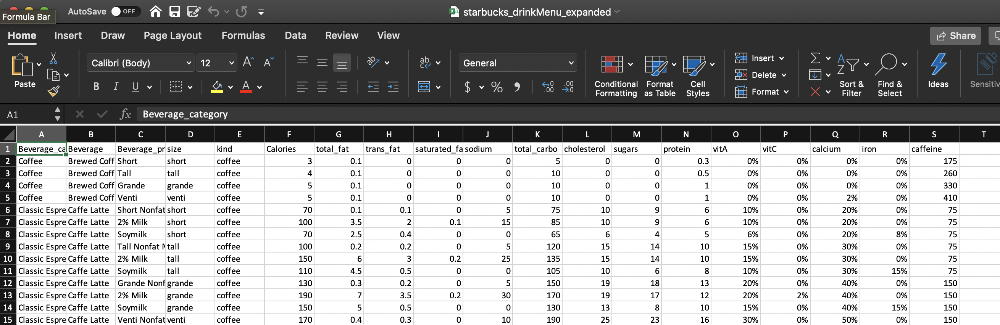
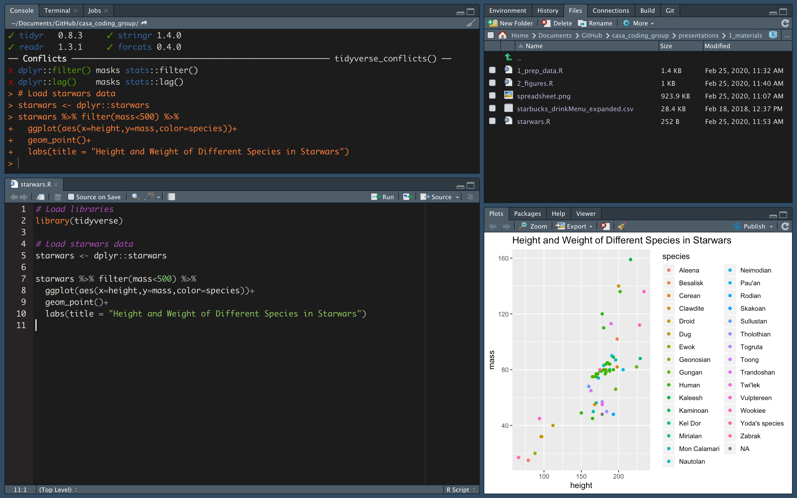
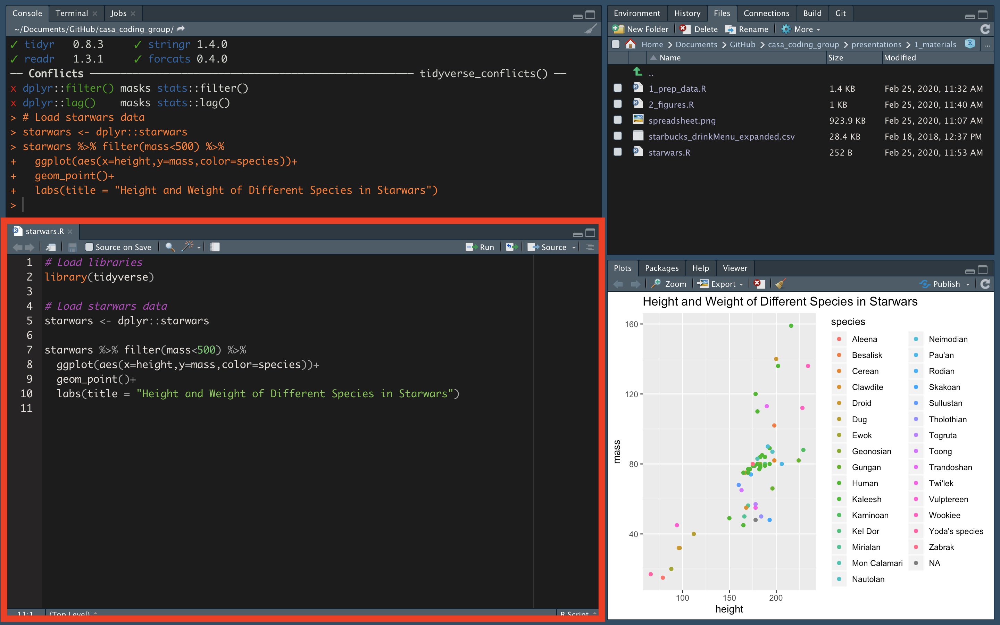
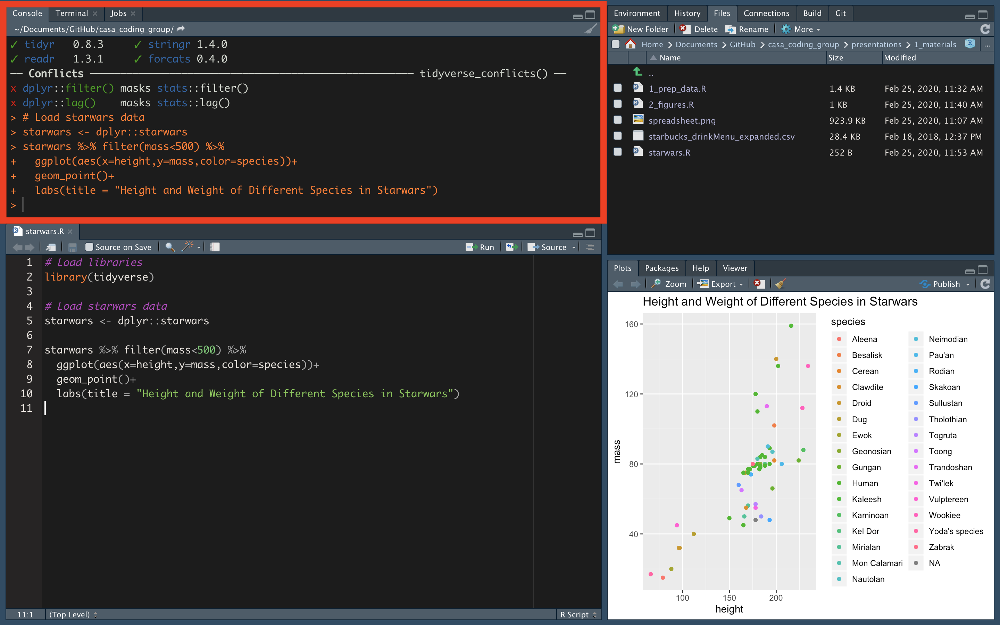
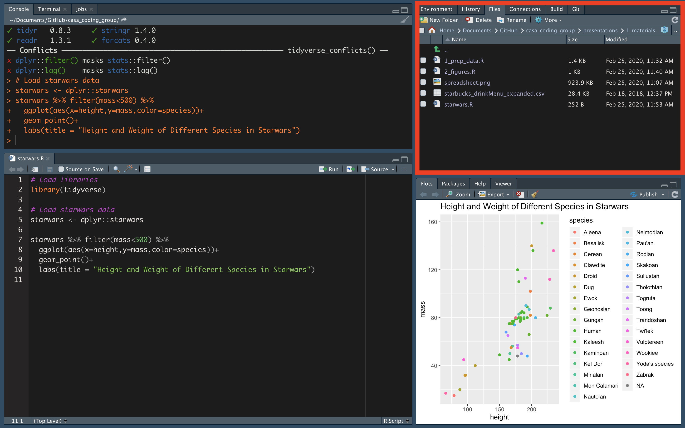
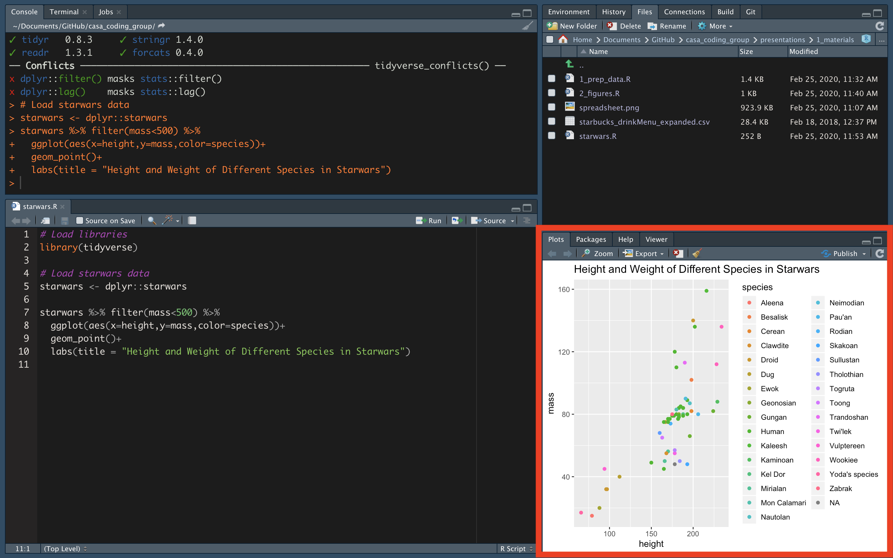

```{r include=FALSE}
# run this first
# pagedown::chrome_print("presentations/1_Intro.html", output = "presentations/1_Intro.pdf")
```


## Outline for today

1. Purpose of group
2. Our tools: Languages/software we will learn
3. Examples of coding applications for speech
4. Download R, RStudio, Praat
5. Intro to RStudio
6. Topics for the term

# Purpose of this group

## Purpose of this group

- Develop skills that make it easier to do our job well as speech researchers
- Create a community that comes together to make it easier to learn this stuff

## Purpose of this group

**Computer Coding**: Writing something in a language a computer can understand in order to tell the computer to do a specific thing or set of things.

Why bother telling a computer what to do when we can just do it ourselves?

## Purpose of this group
***Why bother telling a computer what to do when we can just do it ourselves?***

- Automate repetitive tasks like...
  - opening/closing/saving files
- Minimize human error in data preparation
  - Renaming things in a spreadsheet
- Keep a careful log of how we did our analyses
  - Code = instructions
- "Reproducible research"
- Fun! (seriously!)


# Our tools: Logistics

## Project Website
- Website: https://casa-lab.com/coding-group/
- Slack channel: https://casa-lab-ub.slack.com/
  - [Invite to join Slack channel](https://join.slack.com/t/casa-lab-ub/shared_invite/enQtOTU2OTcwMzg3MDQzLTk4NmM0MjhlYTAyY2JkODhkNDZkYmE5MTc3M2VkZTEyNDg1YjhmMmM0ZmEwYjlkYmI5NTMyZjYxYjk5MDNmMWQ) (I will send this out via email after today)

# Our tools: Languages & Software
## First: Some terminology

**Coding**: Writing in a language a computer can understand

**Scripting**: A type of coding that tells a specific program exactly what actions to take

**Programming**: Writing code that serves to actually create another program (an app, software, etc)

**Scripts**: Text files containing code.

- Scripting, coding, and programming are sometimes used interchangeably

## First: Some terminology

**Functions**: A certain named format of code that outlines a procedure. Often this allows several lines of code to be executed with a single line of code (by using the name of the function) 

- For example, in Excel, you may use functions like `=sum(2,2)`. `sum()` is the function that takes input (in this case, numbers), and performs an a specific action (adds them).

**Calling**: Invoke a function by using the name of the function and specifying parameters.

- For example: I "call the sum function" when I type it out with its inputs and execute it in excel.


## Our tools

1. R and R Studio
2. Praat

## 

- "R is a free software environment for statistical computing and graphics."
- [Download here](https://www.r-project.org/)


##  

- RStudio is a handy interface that helps you use R.
- [Download Desktop version](https://rstudio.com/products/rstudio/download/)


##  Praat

- "Doing phonetics by computer": Praat is a powerful software program that also has its own specialized language for writing scripts
- Praat = "Speech" in Dutch
- Looks like it hasn't been updated since 1995 but it has and it's great
- "World's worst programming language"
  - *don't let the haters get you down*
  
- [Download here](http://www.fon.hum.uva.nl/praat/)


# Examples of coding applications for speech research

## 1. Data preparation in 

**Example: Starbucks data**

1. Start with a data set you have in Excel
2. "Read" it into R
3. Do things to it like...
  - Instantly calculate means values
  
**Let's look together**

## 1. Data preparation: Raw data



## 1. Data preparation: Data prep script

`1_prep_data.R`

```
###################################################
# Helper script for analyzing Starbucks drink data
###################################################

# Setup ----

# Load packages that contain functions we will use
library(tidyverse)
library(plyr)

# Load data ----
starbucks <- read.csv("1_materials/starbucks_drinkMenu_expanded.csv")
```

## 1. Data preparation: Data prep script (Continued)

`1_prep_data.R`

```
# Create new columns ----
# Create a "caffeine" column that is numeric
starbucks <- starbucks %>%
        mutate(caffeine = revalue(caffeine,replace = c(
                                  "varies" = NA, "Varies" = NA)),
               caffeine_num = as.numeric(as.character(caffeine)))

# Is caffeine content over 100 mg? If so, label it "YES", otherwise, "NO"
starbucks <- starbucks %>%
        mutate(too_much_caffeine = ifelse(caffeine_num > 100, "YES", "NO"))

starbucks %>% select(caffeine_num, too_much_caffeine) %>% head()
```


## 2. Data visualization in 

`2_figures.R`

## 3. Writing in 

Using `R Markdown` to write: 

- Notes & reports
- Papers, articles, theses
- Presentations (like this one!)
- Websites, blog posts!

`R Markdown` allows you to incorporate *code* AND regular text using simple "markdown" syntax (more on that later).

## 4. Automating repetitive tasks in 

For example...

- [Automatically create TextGrids for all .wav files in a directory](https://github.com/thealk/PraatScripts/blob/master/Editing_audio_stimuli/createTextGrid.praat)
- [Automatically adjust Praat TextGrid boundaries for all files in a directory](https://github.com/thealk/PraatScripts/blob/master/Praat_scripting_tutorial/3_adjustBoundaries.praat)

## 5. Running experiments in 

[Intelligibility experiment in Praat](https://theaknowles.com/post/measuring-speech-intelligibility-in-praat-part1/)

# Intro to RStudio
## RStudio layout
<center>

</center>

## RStudio layout: Source pane
<center>

</center>

This is where you'll edit and run your scripts.

## RStudio layout: Console pane
<center>

</center>

This is where code, error messages, warnings, etc. show up when you run code

## RStudio layout: Files/Environment pane
<center>

</center>

Here you can see...

1. Files in your directory ("Files")
2. `Variables` in your `environment` ("Environment)
  - This is anything you have created in R. 
  - Saving your work to a script allows you to recreate these variables again later.

## RStudio layout: Plots/Packages/Help/Viewer pane
<center>

</center>

- This is where plots you create will show up when you call them (automatically in "Plots")
- You can also... 
  - search help documentation ("Help")
  - search for packages ("Packages")

## Topics for the term


My thoughts: 

- Next three meet ups: R
- Final meet ups: Praat

Potential meet up flow: 
<span style="color:blue"> Basic skill </span> + 
<span style="color:red"> fun skill </span>
per meet up

- <span style="color:blue"> Intro to R/R Markdown </span> + 
<span style="color:red"> Using emoji in R </span>
- <span style="color:blue"> Cleaning data </span> + 
<span style="color:red"> Making boxplots </span>
- <span style="color:blue"> Making figures in R </span> + 
<span style="color:red"> Making animated figures in R! </span>

***Break up into small groups for a couple of minutes to discuss what you would like to see at this group***

## Schedule for the rest of the term
|  Date|  Time|  Location| Topic|
|--:|--:|--:|--:|
|  2/25|  4pm|  Cary Hall 42| Intro to group + RStudio|
|  3/10|  4pm|  TBD| TBD|
|  3/24|  4pm|  TBD| TBD|
|  4/7|  4pm|  TBD| TBD|
|  4/21|  4pm|  TBD| TBD|
|  5/5|  4pm|  TBD| TBD|


# DO TRY THIS AT HOME `r emo::ji("house")`
## Intro to R
### Try this:

1. Sign up for an account on [udemy.com](udemy.com)

2. Sign up for the ["R basics: R programming language"](https://www.udemy.com/r-basics/) course on udemy

3. Watch videos 1, 2, 3, and 9.

- 1 - R basics (3 min)
- 2 - A walkthrough of downloading R & Rstudio (5 min)
- 3 - the Rstudio interface (19 min)
- 9 - Three common mistakes in R beginners (11 min)
