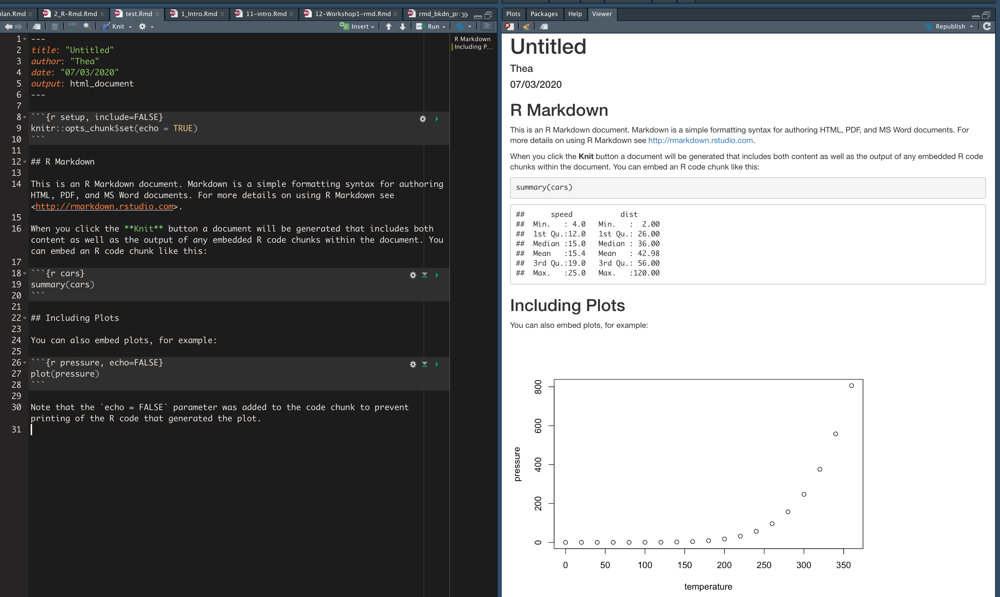
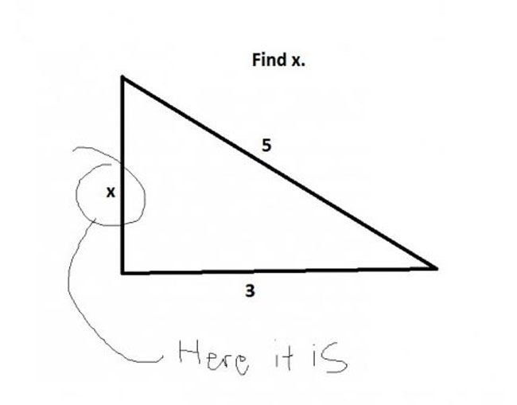
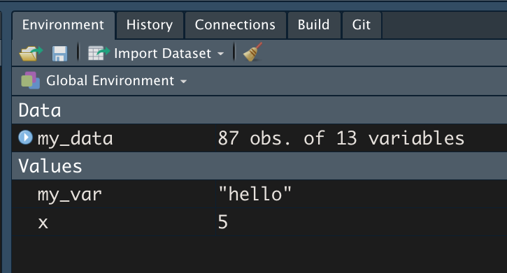
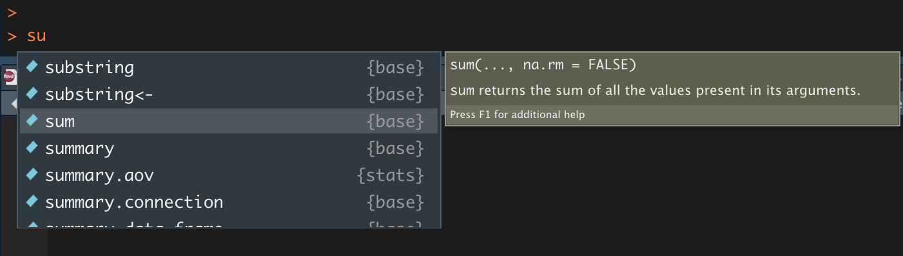

```{r setup, include=FALSE}
knitr::opts_chunk$set(echo = TRUE)
library(emo)
```

```{r include=FALSE}
# run this first
# pagedown::chrome_print("presentations/1_Intro.html", output = "presentations/1_Intro.pdf")
```


## Overview {-}
### Goals
- Learn the basics of the R programming language
- Learn the basics of Markdown writing
- Learn how to combine R code and markdown text to create RMarkdown documents

### Outcomes
- TBD
- Create RMarkdown summary document of things we learned today!

## Don't worry {-}
<center>
<blockquote class="twitter-tweet"><p lang="en" dir="ltr">The funniest thing about this is that the time scale could be one day or the past 5 years.</p>&mdash; C.B. Standelmore (@bankingonbardo) <a href="https://twitter.com/bankingonbardo/status/1202267486726410240?ref_src=twsrc%5Etfw">December 4, 2019</a></blockquote> <script async src="https://platform.twitter.com/widgets.js" charset="utf-8"></script>

*p.s. [Allison Horst's R illustrations are amaaaazing](https://github.com/allisonhorst/stats-illustrations) and I will be using them throughout.*
</center>

# R & R Studio Recap
## R Studio Recap
### Console and script panes in RStudio {-}

<div class="columns-2">


<br>

- <span style="color:red"> Console: </span> Run code, see print outs, see warnings, messages, and errors

<br>

- <span style="color:blue"> Source: </span> Run code from a script. Multiple scripts can be open at once.

</div>


# Markdown
## What is "Markdown?"
<div class="columns-2">

<font size="2">[Hashify.me]()</font>


- Simple syntax that allows you to add tags to plain text to format it
- Originally designed to be HTML replacement
  - Easier to learn and easier to read
- "Minimalist writing system"
</div>

<br><br>

<font size="4">
<center>
[Lifehacker: What is markdown and why is it better for my to do lists and notes?](https://lifehacker.com/what-is-markdown-and-why-is-it-better-for-my-to-do-lis-5943320)
</center>
</font>

# R Markdown
## What is R Markdown?
<div class="columns-2">
<center>

<font size="3">https://rmarkdown.rstudio.com/</font>
</center>

- Integrate R code directly into your writing using basic Markdown syntax
- Reference management integration
- Reproducibility
- Accessible learning curve

</div>

<br>

<center>
`r emo::ji("pencil2")` Very useful for writing summary reports, articles, etc.
</center>

## R Markdown


<font size="5"> 
We're going to make this today!
</font>


# Intro to 

## R Packages & Libraries
**Packages** are bundles of code written to do (typically) specific sets of functions

- Some packages are automatically downloaded and loaded into your workspace when you install R
- Others you have to explicitly download
- Many packages are hosted on CRAN - this is the official "home" of peer-approved packages
  - These can be installed using the function `install.packages()`.

```{r eval=FALSE}
install.packages("tidyverse")
```

- Other packages are not hosted on CRAN - many of these are excellent, but some may be less reliable.
  - Many of these are hosted on GitHub.com 
  - These usually have to be installed using a function `install_github()` which is part of the `devtools` package.
  
```{r eval=FALSE}
# install.packages("devtools")
devtools::install_github("hadley/emo")
```


For example: To install the `emo` package from Hadley Wickham's Github page: 

- [https://github.com/hadley/emo]()


## Libraries
- Libraries in R refer to where the packages are stored. When you install a new package, it gets automatically saved to a particular location (you don't need to specify where). When you want to *use* the contents/functions of a package, you need to "load the library" using the `library()` function.

```{r message=TRUE}
# load the tidyverse package
# expect a bunch of output messages (this is normal)
library(tidyverse) 
```

- If you ask R to load a package you don't have installed, or make a typo in the package name, R will yell at you (give you an *error*):

```{r message=TRUE, warning=TRUE, error=TRUE}
# Typo! what happens? R yells at you.
library(tidverse)
```


## What can you do with R code?
### Use it like a calculator
```{r echo=TRUE}
3 + 2
10^4
4*100
```

## What can you do with R code?
### Print information to the console

```{r echo=TRUE}
print("Hello!")
print(3*5)
```

## What can you do with R code?
### Create new objects

*Read the following as "x is equal to 5"*

```{r echo = TRUE}
x <- 5
```

*And we can now type x in the console to see its value*
```{r echo=TRUE}
x
```

x is now a **variable** that is set to the value of the number 5.

## Variables
**Variable**: a symbol that stores/represents some other *value* or set of values.

Think of variables as containers.

<center>

</center>


## Variable assignment
Variables get **assigned** their value in R with a left arrow `<-`

**Numeric variables** represent numbers
```{r}
x <- 5
```

This means the value of the variable we have named `x` is equal to 5.

**String variables** represent "strings" of text. Text has to be enclosed in quotes `""`

```{r}
my_var <- "hello"
```

This means the value of the variable `my_var` is equal to the text "hello".

## Variable assignment
Variables don't just hold numbers and text - they can hold sets of numbers/text, lists of various kinds of information, and whole data sets!

When you create a new variable in R, you will see it in your Environment pane.




## What do I name my variables?

## Best practices in naming your variables {-}
In R, it's pretty flexible. Not as flexible in other languages (*\*cough\* Praat \*cough\**)

*Some suggestions*

Try your best to...

- Be descriptive
- Be consistent in your content
- Be consistent in your case (camel/snake/etc)

*i_like_snake_case* but some people *likeCamelCase* and others may *like-kabob-case*,

## Variable names: Choose your case
<center>

<font size="3">
[https://github.com/allisonhorst/stats-illustrations]()
</font>
</center>

## Variable names: Not okay

**General rules:**

|    Not allowed     |                                         Why                                          |
| :---------------- | :---------------------------------------------------------------------------------- |
|        1abc        |                                 Starts with a number                                 |
|  intelligibility%  |                   Contains a special character like !@#$%^&*, etc.                   |
|      .1my_var      |                    Starts with a period followed by a number (.1                     |
|      _my_var       |                            Starts with an underscore (\_)                            |
| special characters | Some words have special meaning to R and you shouldn't overwrite them (e.g., "mean") |

## Variable names: Better

|                  Allowed |                      Good because |               Bad because |
| -----------------------: | --------------------------------: | ------------------------: |
|                        x |                  short, lowercase |            Not meaningful |
|   intelligibility_scores |      meaningful, easy to remember | Takes a long time to type |
|                 int_mean |                 meaningful, short |      `r emo::ji("shrug")` |
| int_mean_pd, int_mean_hc | meaningful, shortish, descriptive |                A bit long |


## Beware of typos!
```{r error=TRUE}
my_var <- 5

My_var
myVar
my_var
```


## But will I break it?

## Try it!

### Numeric variables
In your console, do the following:

- Create a variable x and assign it a value of some number
- Create a variable of y and assign it a value of some other number
- Create some other variable (name it whatever you like!) and assign it a value of yet another number

### String variables
In your console, do the following:

- Create a variable `a` and assign it a value of some text (don't forget to enclose the text in quotes!)
- Create a variable `b` and assign it a value of some other text
- Create a variable with another name and assign it yet another text value


## Types of data
1. Numeric
  - Integers (whole numbers)
2. Strings: collection of characters
  - e.g., "abc", "the rainbow is a division of white light"
  - numbers and other non-letter characters can also be treated as strings
3. Factors: categorical variables. Make up a finite set
  - e.g., "Blue" "Green" "Red"
4. Logicals: special kind of factor that only has two values
  - TRUE vs FALSE, 0 vs 1
  
## Types of data structures
1. **Data frames**: collections of vectors
2. **Vectors**: collection of similar elements (numbers, characters, factors, etc..)
3. Matrices
4. Lists
5. Arrays

## Comments
- In R code, any line of code preceded by a hashmark (#) is not *evaluated* (i.e., it's ignored)
- You can write notes to your future self this way

```{r eval=FALSE}
# Set x equal to 0
x <- 0
# Now add 1 to the value of x
y <- x+1
```


## Functions
**Functions**: A certain named format of code that outlines a procedure. Often this allows several lines of code to be executed with a single line of code (by using the name of the function) 

- In other words, functions are **actions**. 
- Most functions take **arguments**
  - What do you want to act on?

## Calling functions

### function_name(argument1, argument2, ...)

- In R Studio, if you start typing the name of a function and hit tab, you will get a pop up with possible options. 
- Within the () of the function, pressing tab will help you add the arguments.



## Looking at data: A spreadsheet perspective

```{r echo=FALSE}
my_data <- read.csv("../presentations/2_materials/simulated_vot_data.csv")
```

Most of us are used to looking at data in the form of a spreadsheet.

- Named columns with many rows
- Each row usually represents one observation

*See simulated_vot_data.csv*

## Looking at data: A spreadsheet perspective

### My usual workflow: 

- Collect data in spreadsheet
- Load spreadsheet data into R
- Do all other data manipulation and analyses in R

## Looking at data
### A spreadsheet perspective

In R, data often are stored in `data_frames`. 

Columns stored in variables named with the column header name

To access individual columns, use the `$` operator

```{r eval = FALSE}
my_data$Participant
```

## Looking at data
### Take a peak

To peak at the first 6 rows of the data, use the `head()` function

```{r}
head(my_data)
```


## Looking at data
### Subsetting

We can also look at subsets of data

```{r}
subset(my_data, Condition=="Fast")
```


## Looking at data
### Using the pipe `%>%` to combine functions

```{r eval=FALSE}
my_data %>%
  first_do(args) %>%
  then_do(args)
```


```{r}
my_data %>%
  subset(Condition=="Fast") %>%
  head()
```


## Tidyverse

>"The tidyverse is an opinionated collection of R packages designed for data science. All packages share an underlying design philosophy, grammar, and data structures."
[www.tidyverse.org]()

- Changed the game of R coding
- Much more intuitive syntax (IMHO); more "english-like"
- BUT not everyone likes it. Sometimes makes things easier, sometimes makes things more complicated.
- We'll be using both
- Core packages of the tidyverse: ggplot2, dplyr, tidyr, readr, stringr...


## Tidy data & the Tidyverse
- See https://github.com/rladies/meetup-presentations_auckland/blob/master/2017-12_tidyverse-6-auckland.pdf

- "the pipe is syntactic sugar"

## Disclaimer
- We will cover both base R and the Tidyverse

## Getting started: R Projects

## Application
Open 1_prep_data.R from today's materials.


## Rmarkdown
[](https://github.com/allisonhorst/stats-illustrations)
[RStudio's "What is R Markdown" Video](https://vimeo.com/178485416)

The goal of today's workshop is to establish a workflow for using the [`rmarkdown`](https://rmarkdown.rstudio.com/) package to "knit" together R code and text to create summary documents.

It might seem kind of odd to launch into a workflow that ties together R code *and other stuff* before we've actually had a chance to learn any R code, but here's the rationale:

1. `r emo::ji("hammer_and_wrench")` **Foundational skill:** R Markdown document creations can serve as a way to document the rest of our skills. At each workshop, we'll create another R Markdown document (extension .`Rmd`) to log the skills we worked on and any notes you'd like to keep for yourself. In this way, this skill is *foundational*.
2. `r emo::ji("raised_hands")` **Instant gratification!** R Markdown documents can be rendered without much working knowledge of R at all. It's a lovely thing when you can get something up and running RIGHT AWAY

## Markdown {-}
**Markdown** refers to a set of conventions for editing plain text. With markdown syntax, you write as you normally would in a text editor or word processor, but you signal text formatting with certain characters. Markdown (which is distinguished from *markUP* language) is designed to be **easily readable, easy to write, and easy to learn**.

```
*italic*
**bold**
**italic and bold!***

# First level header
## Second level header
## Third level header

1. the first item on a numbered list
2. the second item on a numbered list

- the first item on a bulleted list
- the second item on a bulleted list
  - item 2a
  
Tables look like this: 

First Header  | Second Header
------------- | -------------
Content Cell  | Content Cell
Content Cell  | Content Cell
```

## Code chunks {-}


## More advanced
- inline R code
- 

## Getting unstuck
- Google your errors!
- Google "how to use XX package in r"
- Search Twitter (#rstats)


## Schedule for the rest of the term
|  Date|  Time|  Location| Topic|
|--:|--:|--:|--:|
|  2/25|  4pm|  Cary Hall 42| Intro to group + RStudio|
|  3/10|  4pm|  Cary Hall 135| Intro to R + R Markdown|
|  3/24|  4pm|  Cary Hall 135| Cleaning + manipulating data|
|  4/7|  4pm|  Cary Hall 135| Data visualizations|
|  4/21|  4pm|  Cary Hall 135| Praat?|
|  5/5|  4pm|  Cary Hall 135| Praat?|

## Resources {-}
- [Intro to RMarkdown: Video](https://www.youtube.com/watch?v=0yAIeykkRhw&feature=youtu.be) (12 minutes)
- [RMarkdown: The definitive guide](https://bookdown.org/yihui/rmarkdown/)
- [R for data science: R Markdown](https://r4ds.had.co.nz/r-markdown.html)
- [RMarkdown cheat sheet](https://rstudio.com/wp-content/uploads/2015/02/rmarkdown-cheatsheet.pdf)
- [RMarkdown reference guide from RStudio](https://rstudio.com/wp-content/uploads/2015/03/rmarkdown-reference.pdf)
- [RMarkdown Cheatsheet from RStudio](https://rstudio.com/wp-content/uploads/2015/03/rmarkdown-reference.pdf)


